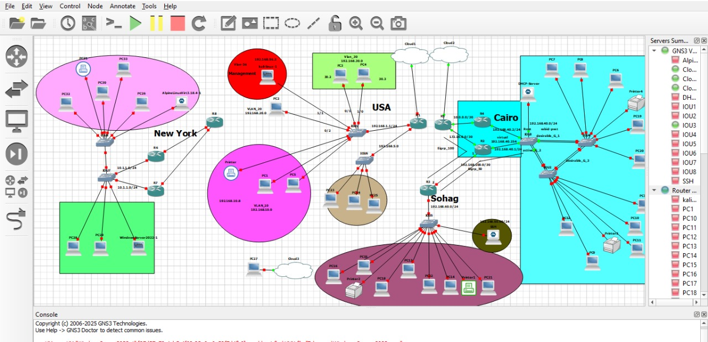

## 📁          Project Network Architecture Design

## 🖥️ Lab Description

In this project, I used a **Cisco 7200 router image** running legacy IOS inside GNS3.

-----------

## 🔧 Technologies & Features Used

This network security lab incorporates several core Layer 2 and Layer 3 technologies to simulate a real-world enterprise environment. The setup includes:

- **VLANs**: Implemented for network segmentation and traffic isolation.
- **Backup Router using HSRP**: High Availability is achieved using Hot Standby Router Protocol (HSRP), ensuring redundancy between active and standby routers.
- **Root Switch Configuration**: Manual root bridge election for Spanning Tree Protocol to control Layer 2 topology.
- **Rapid PVST+**: Deployed to enable faster convergence in Layer 2 network topology changes.
- **DHCP**: Dynamic Host Configuration Protocol configured to automatically assign IP addresses to end devices.
- **EIGRP**: Enhanced Interior Gateway Routing Protocol used for dynamic Layer 3 routing across multiple network segments.
- **EtherChannel**: Used to bundle multiple physical links into one logical link for load balancing and redundancy.
- **Active & Standby Routers**: Dual-router setup configured for failover scenarios to maintain uninterrupted network service.

-------

## 🖼️ Screenshots

Below are some visual references from the lab:

------------

> 🧠 **Tip**: This project can serve as a reference for penetration testing labs, security appliance integration, or simulating real-world outdated infrastructure.

----------

The router does **not support modern SSH cryptographic algorithms** used by default in current OpenSSH clients.

# 🛡️ Legacy Router SSH Access Lab (Cisco 7200) - Security GNS3 Project

This project demonstrates how to configure secure SSH access to a legacy Cisco 7200 router running inside a GNS3 environment. Due to the outdated cryptographic support on legacy IOS images, modern OpenSSH clients require customization to successfully connect.

# SSH Access to Legacy Router (Cisco 7200)

In this project, I used a Cisco 7200 router image (running legacy IOS) inside GNS3.

# ⚠️ Issue:
The router does not support modern SSH cryptographic algorithms used by default in modern OpenSSH clients. When trying to connect, the following error appears:

----Unable to negotiate with 192.168.60.1 port 22: no matching key exchange method found.

This is because the router only supports older algorithms like:
- `diffie-hellman-group1-sha1`
- `diffie-hellman-group14-sha1`
- `ssh-rsa`
- `aes128-cbc`

## ✅ Solution:
To connect successfully from a modern Linux SSH client (e.g. Alpine), I created a custom SSH config to allow these older algorithms.

## nano ~/.ssh/config
Host r3
    HostName 192.168.60.1
    User cisco
    KexAlgorithms +diffie-hellman-group14-sha1
    HostKeyAlgorithms +ssh-rsa
    Ciphers +aes128-cbc

## chmod 600 ~/.ssh/config

                  💡 Usage:
ssh r3

